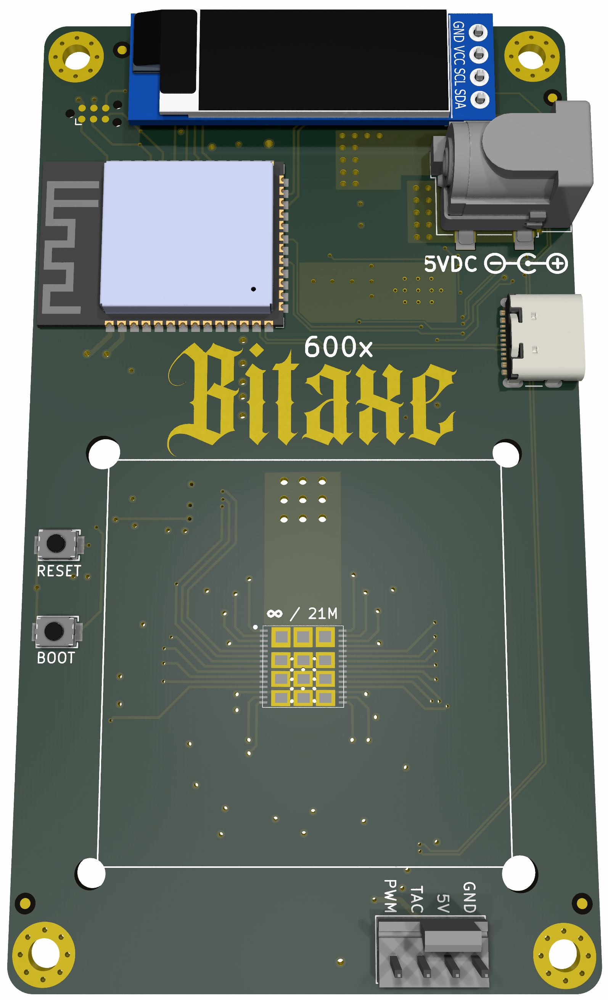

```
Open Source is Intrinsic to Bitcoin
```
# The bitaxeGamma
bitaxe is a fully open source hardware Bitcoin ASIC miner. Supra is the 5th major revision of the bitaxe that now includes the BM1370 ASIC from the Antminer S21 Pro



## Goals
- **Standalone**: can mine directly to your pool over WiFi. No External computer needed.
- **Embedded**: low cost, low maintenance, high availability, high reliability, low power.
- **ASIC**: based on the very, very efficient BM1370 from Bitmain.
- **Versatile**: solo/pool mining, autotune power/heat/efficiency.
- **Open Source**: All design files are provided.

## Features
- **ESP32-S3-WROOM-1** wifi microcontroller on board
- **TI TPS546D24** buck regulator steps down the 5V input to power the BM1370
- **Microchip EMC2101** PWM controls the fan and monitors tach output. BM1366 doesn't support die temp, but we have it placed super close to the ASIC so we can use the internal temp feature.
- 0.91" **SSD1306 OLED** I2C Display Module 

## BM1370
- The BM1370 is a undocumented SHA256 mining ASIC from Bitmain. It's used in the Antminer S21 Pro
- Bitmain claims the BM1370 has 17.5 J/TH efficiency
- The BM1370 is brand new and isn't available anywhere yet.
- The BM1370 has a different footprint and pinout from the BM1368, BM1366, BM1397 and BM1387 in previous bitaxe.

## Current Status
- Bitaxe Supra 600x parts and PCBs has been ordered, but nothing has been verified
- Be sure to check the [issues](https://github.com/skot/bitaxe/issues) for known bugs, reworks and errata.
- This is an _advanced_ build! You can do it, but if you're not looking for a project, it might be best to buy one pre-assembled from one of the many sellers.

## Hardware
- Order PCBs from your favorite PCB shop, like [JLCPCB](https://jlcpcb.com), [SeeedStudio](https://www.seeedstudio.com/fusion_pcb.html), or [PCBWay](https://www.pcbway.com)
    - Gerbers are in the `Manufacturing Files` dir. PCBs are 4-layer, 6mil trace/space and 0.3mm hole compatible. 1oz outer / 0.5oz inner layer thickness works well.
    - Make sure to order stencils too. These are the "paste" layers in the gerbers folder. one for top and one for bottom.
- All PCB parts except the ASIC are available from [DigiKey](https://www.digikey.com/en/products) and others. You can find Digikey part numbers on the DK tab of the BOM
- [40x40mm heatsink and 5V fan](https://www.aliexpress.com/item/2251832861666365.html) from a random AliExpress seller. The fans are crap, but the heatsinks are good. **make sure** to use a good quality thermal compound between the heatsink and ASIC!
- Upgrade your fan with the [Noctua NF-A4x10](https://noctua.at/en/nf-a4x10-5v-pwm) 5V 4-Pin fan for a much more pleasant experience.
- Supports 0.91" SSD1306-based I2C OLED Module. [Example Amazon seller](https://www.amazon.com/gp/product/B08ZY4YBHL)
- [KiCad 8](https://www.kicad.org) design files

## Software
- The [ESP-Miner](https://github.com/skot/ESP-Miner) has not yet been modified to support the BM1368. Hopefully soon!

## Cooling
- You **must** have active cooling on the bitaxe. 
- The Bitaxe has a connector for a 5V fan. 40x40mm fans work nicely with the suggested heatsink
- The fan connector uses the 4-pin standard:
	- 2 pins are for 5V power
	- pin 3 is fan speed sensing
	- pin 4 is fan speed control (PWM) 

## Power Supply Requirements
- **5V DC Only!** Anything else will damage the Bitaxe. Be careful and double-check your power supply is 5V. Many other voltage power supplies use the same connector.
- [5VDC Power supply](https://www.amazon.com/BTF-LIGHTING-Plastic-Adapter-Transformer-WS2812B/dp/B01D8FM4N4). Should be capable of over 15W
- The bitaxe uses a 5.5x2.5mm, center-positive barrel jack.

### ESP32 Programming Requirements
- As of the bitaxeUltra, all ESP32 programming is done through a USB-C cable and connector on the bitaxe. See [ESP-Miner](https://github.com/skot/ESP-Miner) for more details.

## Building
- Check out [building.md](building.md) for PCB ordering tips
- Check out [assembly.md](assembly.md) for assembly tips
